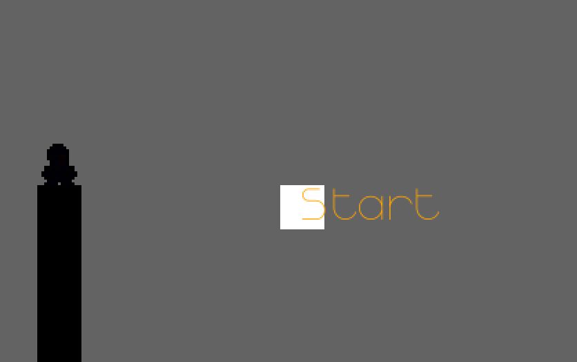
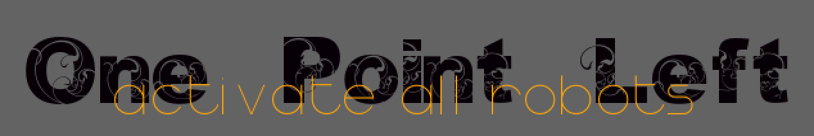

# Change History # {.unlisted}

| Version |          Who           |         What        |    When    |
|---------|------------------------|---------------------|------------|
| 0.0.1   | Orhan Küçükyılmaz (OK) | Initial Document    | 17.04.2014 |
| 0.0.2   | Orhan Küçükyılmaz (OK) | Updated Image       | 08.07.2015 |
| 0.0.3   | Orhan Küçükyılmaz (OK) | Added Project Goals | 02.07.2017 |

# Introduction #

    a jump'n'shoot riddle game

After the Hero's attack, it's your duty to...

> _activate all robots!_

Every `'activation-shoot'` costs you `points`.
For every robot, machine or trap you activate,
you get `points`.
If you get hit, you lose a `point`.
If you have only _`one point left`_
than you have only `one` _ONE_ shoot to make points or it's ...

> >... _GAME OVER!_

# Levels, Robots, and more #

In this Section it's all about the levels the robots and more.

## Level 0 - The Start/Menu level ##

Most games don't have a playable menu level. What is a playable menu level?, you ask.
Good question very good question indeed.

What is a menu?

Before a person can start a game he usually select from a menu what he wants
to do. The menu is usually something like:

+ Start
+ Options
+ ...(something something)

Here the controls are different to the controls in the game.

Up and down on a joy-pad, joystick or on a keyboard (sometimes "w" for up
and "s" for down) toggle between the menu items. With one button on the
joy-pad, joystick or keyboard (sometime space or enter) the user select what
he wants to do.

In this game the menu is a playable level. Why?
So the user uses the actual controls of the game and not some extra controls
for the menu. So he can learn the controls for the game early.

Level 0 teaches the player how to play the game, and presents him the first
robot to activate.

But first let us take a look at the elements of the first level:

# Project goals #

No project is ever done if there are no goals set. To know when the Version 1.0.0 is done of
this game, some goals are set.

Some of this gaols will be hard set goals, like the number of different levels, robots, boss
robots and such. some goals will be soft, like graphics, sound, all the look and feel.

## Levels ##

A minimum of at least 5 levels

### Level Structure ###

Each level exist of 5 sub-levels. Each new level introduces a new robot, each sub-level
introduces a a new sub-version of the robot.

e.g.

__Start Level__

+ 0-0 (Start Level) Start Robot
+ 0-1 (Start Level) Exit Robot
+ 0-2 (Start Level) Reset Robot
+ 0-3 (Start Level)

+ 1-1 Jump Robot
+ 1-2

